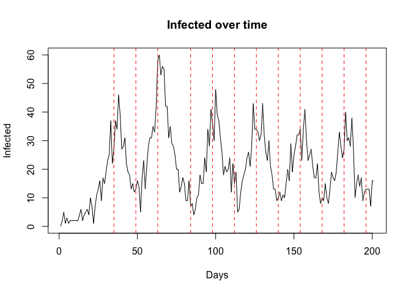

# Wastewater simulation with epiworldR


This quarto document provides an example of how we can simulate the
detection and an intervention based on wastewater surveillance. The
assumption is that individuals shade at an assummed rate, and then
wastewater is sampled and detections take place at a given probability.
If the number of detections exceeds a threshold, then an intervention is
triggered. Sampling of wastewater happens at a given interval (it could
be daily or not).

The intervention is implemented using the `globaleven_fun()` utility
from the epiworldR package.

## Setup

The full implementation of the tool can be found in the file
[intervention.R](intervention.R). The function
`wastewater_detect_factory()` is the one that implements the
intervention. It takes a model and a set of parameters, and returns a
modified model with the intervention implemented.

``` r
source("intervention.R", echo = FALSE)
```

    Thank you for using epiworldR! Please consider citing it in your work.
    You can find the citation information by running
      citation("epiworldR")

    Using epiworldR in your research? Please cite it: citation("epiworldR")

To test this, we will use the `ModelSEIRCONN()` model, which is a simple
SEIR model that assumes homogenous mixing and at a given contact rate.
The model is calibrated so that R0 is approximately 3. We will run the
model with 10,000 agents:

``` r
r0 <- 3
model <- ModelSEIRCONN(
  name = "Flu with wastewater detection",
  n = 10000,
  prevalence = 10/10000,
  contact_rate = 20,
  transmission_rate = r0 * (1/7) / 20,
  incubation_days = 7,
  recovery_rate = 1/7
)
```

The implementation for this case is an example where we are assuming a
high detection probability and a drastic reduction in the contact
rate–so this is just for illustration and validation of the
implementation.

``` r
# Adding the factory
wastewater_detect_factory(
  model,
  detect_prob = .999,
  crate_reduction = .9,
  intervention_threshold = 150
)
```

We run the model usijng the `run()` function, for 200 days and with a
seed of 133:

``` r
run(model, ndays = 200, seed = 133)
```

    _________________________________________________________________________
    Running the model...
    ||||||||||||||||||||||||||||||||||||||||||||||||||||||||||||||||||||||||| done.

Verifying the reproductive number:

``` r
library(data.table)
```

    Warning: package 'data.table' was built under R version 4.5.2

``` r
rt <- get_reproductive_number(model) |>
  as.data.table()

rt[source_exposure_date == 0, mean(rt)]
```

    [1] 2.4

## Results

The following code shows how can we visualize the results of the
simulation. The red vertical lines indicate the days when the wastewater
sampling was done, and the intervention was triggered.

``` r
ans <- plot_incidence(model, plot = FALSE) |>
  as.data.table()

plot(
  ans$Infected, type = "l",
  main = "Infected over time",
  xlab = "Days",
  ylab = "Infected"
  )

# Creating this as a two column matrix
# It should be filled by row, if the length is odd
# then we complete it adding the last day as the duration
# of the simulation (get_ndays(model))
if (length(wastewater_counter) %% 2 == 1) {
  wastewater_counter <- c(
    wastewater_counter,
    get_ndays(model)
  )
}

wastewater_counter <- matrix(
  wastewater_counter,
  ncol = 2,
  byrow = TRUE
)

wastewater_counter[, 2] <- -wastewater_counter[, 2] 

# adding vertical bands that start and end
# at the first row and first column of the matrix
# respectively
for (i in seq_len(nrow(wastewater_counter))) {
  abline(
    v = wastewater_counter[i, ],
    col = "red",
    lty = 2
  )
}
```



As expected, throghout the simulation, as the number of cases starts
climing, the intervention is triggered and the contact rate is reduced.
